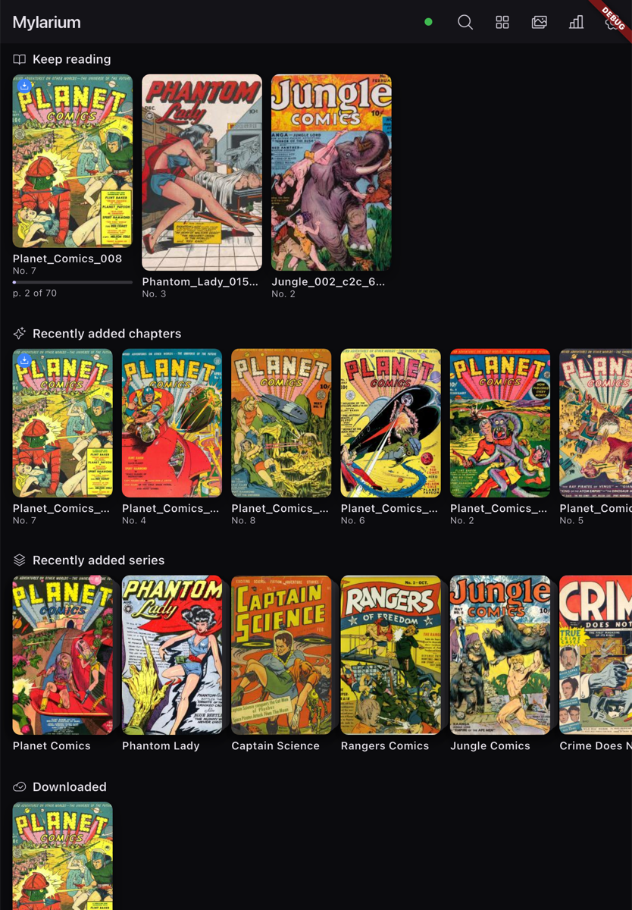

# Mylarium

A premium, cover-forward comics and manga reader for iOS and Android, backed by your self-hosted Komga server with always-on offline reading.

  

## Features

- Connects to your self-hosted **Komga** server (local files too)
- Always-on **offline**: download once, read anywhere, survives app restarts
- Two-way **reading progress sync** with Komga
- **Reader**: paged left-to-right and right-to-left, gapless webtoon, and double-page spreads
- Pinch-zoom and per-page **color correction**
- Cover-forward design with **dark**, **light**, and **auto** themes
- Adaptive **tablet** layout with a two-pane browser
- **Reading stats** kept on your device
- **CBZ**, **CBR**, and **CBT** archives (CB7 best-effort)
- **Privacy first**: no telemetry, nothing leaves your device

Built with Flutter for iOS, iPadOS, and Android.
