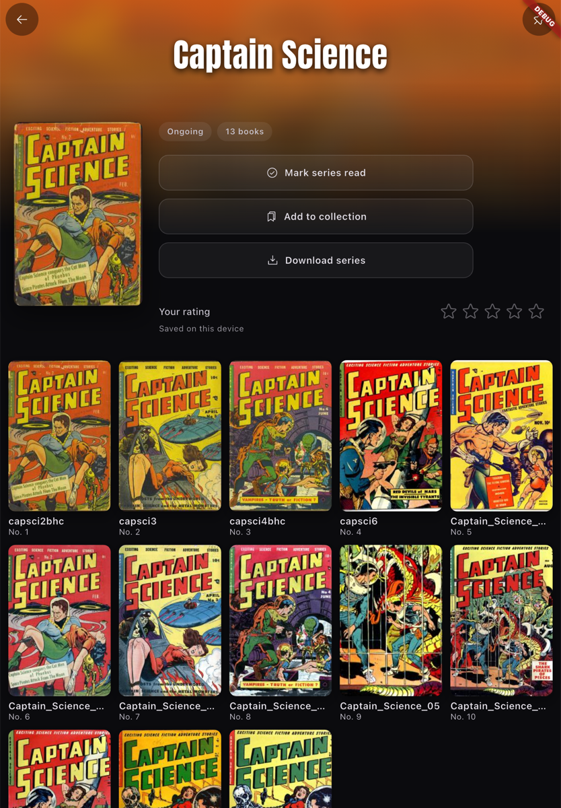

# Mylarium

A premium, cover-forward comics and manga reader for Android, backed by your self-hosted Komga or Kavita server with always-on offline reading.

  
  
  

## Features

- Connects to your self-hosted **Komga** or **Kavita** server (local files too)
- Always-on **offline**: download once, read anywhere, survives app restarts
- Two-way **reading progress sync**
- **Reader**: paged left-to-right and right-to-left for **manga**, gapless webtoon, and double-page spreads
- Pinch-zoom and per-page **color correction**
- **Capture** favorite panels and moments to a built-in **gallery**
- Cover-forward design with **dark**, **light**, **auto**, and **e-ink** themes
- Adaptive **tablet** layout with a two-pane browser
- **Reading stats** kept on your device
- **CBZ**, **CBR**, and **CBT** archives (CB7 best-effort)
- **Privacy first**: no telemetry, nothing leaves your device

Built with Flutter.
